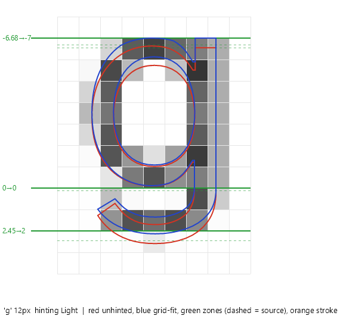

# Hinting

Grid fitting in the managed path has two engines. Fonts that ship real TrueType hinting execute their own bytecode through a managed interpreter with FreeType v40 semantics; every other font goes through a light auto-hinter in the FreeType tradition - font-wide alignment zones plus per-glyph edge fitting, expressed as monotone piecewise-linear coordinate warps applied to the captured device-space contours before rasterization. The bytecode engine never gambles: a program fault, budget overrun or malformed stream vetoes the font at that size and the draw falls to the auto-hinter, whose own ambiguity degrades to identity, never to a misfit.

## The ladder: TextOptions.TextHintingMode

| Mode | Instructed fonts (bytecode) | Other fonts (auto-hinter) | Positioning |
| --- | --- | --- | --- |
| `None` | off | off | quarter-pixel subpixel phases |
| `Light` / `Unspecified` | v40 class: programs run fully, moves land vertically only | zones + stroke pairs | quarter-pixel subpixel phases |
| `Strong` | full interpretation: moves land on both axes | zones + stroke pairs + stem snapping | integer pens (phase 0) |

`Unspecified` consults the font's [gasp table](../../src/Avalonia.Base/Media/Fonts/Tables/GaspTable.cs) before settling on Light - the table is the designer's own per-size rendering contract, and three signatures change the resolution:

- A range that requests grid fitting and nothing else - no grayscale flag, no ClearType-aware flag - is the hinted bi-level signature of legacy fonts (Courier New declares it up to 36 ppem), and DirectWrite answers it with GDI-classic rendering. Such draws escalate to the Strong treatment.
- A range that requests grid fitting with no smoothing flag beyond `SYMMETRIC_GRIDFIT` (no `DOGRAY`, no `SYMMETRIC_SMOOTHING`) marks a ClearType-era font that expects its bytecode to run (Tahoma and Verdana at text sizes). It escalates to Strong only when the font actually has hinting machinery to execute; without programs the auto-hinter's Light treatment serves better than imitation strength.
- A size below every grid-fitting range of a font that does hint larger sizes is the designer saying "too small to fit" - Tahoma declares such a range under 8 ppem. Those draws degrade to None and render unfitted; fonts that never request grid fitting anywhere keep Light.

Any other smoothing signature, or no gasp table at all, keeps the natural Light treatment (Noto Mono's grid-fit ranges carry `DOGRAY` - no escalation). An explicit `Light` always wins over the table; the resolution only ever applies to `Unspecified`.

The mode travels through the inherited `TextOptions` attached properties and is resolved per draw in [MaskGlyphRunRenderer](../../src/Avalonia.Base/Media/Fonts/Rasterization/MaskGlyphRunRenderer.cs): `GridFit = mode != None`, `PenSnap/StemSnap = mode == Strong`, both after the gasp resolution above. Both bits are part of the glyph and run cache keys, so variants coexist in the caches. When a draw falls through to the native blob, the setting maps to the backend's nearest equivalent (on Skia: `Light` and `Unspecified` to slight hinting with the auto-hinter forced, `Strong` to full hinting).

`TextOptions.BaselinePixelAlignment` is honored by the blob path; the managed path currently always rounds the baseline to a pixel row (the `Aligned` behavior). Honoring `Unaligned` would require vertical subpixel phases in the mask key and is deliberately deferred.

## The TrueType bytecode engine

Legacy UI fonts carry their small-size quality in per-glyph instruction programs - Tahoma at 9 px is a different drawing than Tahoma scaled down, full of delta exceptions no geometric fitter can reconstruct. The interpreter under [Rasterization/TrueType](../../src/Avalonia.Base/Media/Fonts/Rasterization/TrueType) executes those programs: the full instruction set in 26.6 fixed-point integer math end to end, so hinted output stays bit-identical across platforms and architectures.

**Eligibility.** `GlyphTypeface.HasTrueTypeHinting` requires glyf outlines plus real machinery: an fpgm or a cvt. Modern unhinted exports ship a trivial prep and nothing else; treating that as "hinted" would silently replace the auto-hinter with identity outlines, so a lone prep does not qualify. Eligible grid-fit builds in [GlyphMasks.Build](../../src/Avalonia.Base/Media/Fonts/Rasterization/GlyphMasks.cs) fetch a hinter from a per-typeface cache keyed by quantized scale and render class, with vetoes memoised so a failing font pays once.

**Size states.** Per size, `TrueTypeSizeState` runs the font program (function definitions), then the control value program against the scaled CVT, and snapshots the result. Glyph programs run against copy-on-write views of that snapshot - fonts do write CVT and storage mid-glyph, and nothing they write can leak into the next glyph or the next frame. `INSTCTRL` requests from the prep are honored: a font that disables its own instructions at a size renders unfitted there, because the font asked for nothing, not for the auto-hinter.

**Mode classes.** Light and Unspecified run the backward-compatibility class of FreeType's v40 interpreter (semantics pinned against FreeType `9e9d3b73`, 2026-08): programs execute fully, but point moves land vertically only - x stays untouched, preserving designed advances and subpixel positioning - and vertical moves freeze once the glyph's IUP passes have run. This is the DirectWrite-natural rendering class. Strong and Aliased builds run full interpretation on both axes, the classic GDI class, where stem-aligned quantized placement is the point.

**Composites.** Components are fully hinted before assembly, transforms and offsets apply to the fitted points, and the composite's own program then runs over the assembled glyph with fresh touch flags. `USE_MY_METRICS` adopts the flagged component's hinted phantom points.

**Advances stay unhinted.** The engine maintains and fits phantom points because programs reference them, but the advance that positions the next glyph still comes from hmtx and the shaper. Spacing stays natural in every mode; a GDI-compatible hinted-advance opt-in would be a metrics-layer change, not an engine change.

**Variable fonts.** Variation instances hint through their own size states - each `WithVariation` clone carries its own hinter cache, so nothing is keyed across instances. The loader feeds gvar-varied outlines to the interpreter in two precisions, the reference's model: interpolation instructions measure against points rounded to whole font units (half up), while the scaled positions keep sub-unit delta fractions and round once after the scale. A [cvar table](../../src/Avalonia.Base/Media/Fonts/Tables/Variation/CvarTable.cs) adjusts the unscaled control values per instance before the control value program runs (its shared-tuple indices resolve into gvar's records); fonts without cvar hint on the default CVT, which is spec-conformant - Bahnschrift does exactly that, while Segoe UI Variable ships a cvar that retunes stem controls toward its optical-size minimum.

**Hardening.** Instruction, loop-call, jump and call-depth budgets bound every program; a fault or overrun halts cleanly and vetoes, never throws, and the copy-on-write scoping keeps hostile glyphs from corrupting the size state. The engine is fuzz-tested over random streams and bit-flipped real tables, and its output is pinned by committed cross-platform hashes (see [testing.md](testing.md)).

## The fallback auto-hinter

Uninstructed fonts - most modern exports - get the geometric treatment: measured font-wide zones, per-glyph stroke fitting and optional stem snapping, all expressed as coordinate warps on the captured contours.

### Font-wide zones: VerticalGridFit

[VerticalGridFit](../../src/Avalonia.Base/Media/Fonts/Rasterization/VerticalGridFit.cs) measures each typeface's alignment zones once, from glyph ink boxes only (no geometry walks): x-height from 'x', cap height from 'H', ascender from 'l' or 'b', descender from 'p' or 'g', the round-letter overshoot from 'o', and the f hook's overshoot over the ascender (accepted as an overshoot up to em/24; larger excess, like 't', owns its height). For every quantized scale it builds a cached `AxisWarp` whose knots move each zone onto a pixel row, with slope 1 outside the outermost knots and the baseline anchored at 0.

The rounding policy was measured against DirectWrite output rather than assumed:

- zones above the baseline grow away from it when their fractional part is at least `ZoneGrowThreshold = 0.4` (a 8.4 px cap becomes 9 rows, matching DirectWrite); below the baseline plain nearest rounding applies;
- distinct zones landing within half a pixel of each other (Segoe UI's cap sits 82 design units under its ascender, 0.36-0.48 px at 9-12 px) share one row at plain nearest of the topmost member - the measured DirectWrite resolution (9 px: round(6.66) = 7, never the cap's 6), and the merged cluster emits one flat shelf so caps, digits, l and f land on the same line; zones at identical design heights are one line, not a collision, and keep the grow policy;
- overshoot bands flatten onto their zone row while the overshoot is at most `OvershootFlattenLimit = 0.75` px and survive as a distinct row beyond that, which is when the eye starts expecting it; each zone carries its own band ('o' for x-height, cap and baseline, the f hook for the ascender).

*(Generated figure: run TextTestApp with `GLYPH_FIGURE_EXPORT_DIR=<dir>` to regenerate; the interactive version lives in TextTestApp's Rasterization tab.)*

### Per-glyph stroke fitting: GetGlyphWarp

Zone knots alone leave a problem: between knots the warp interpolates with slope not equal to 1, so interior horizontal strokes (the crossbars of 'e' and 'f', the arms of 'E', bowl waists) change thickness and land off the grid, rendering as two gray partial rows. That reads as washed-out text precisely when hinting is on.

`VerticalGridFit.GetGlyphWarp(contours, scaleQ)` refines the cached zone warp per glyph. [StemFit.CollectStrokeKnots](../../src/Avalonia.Base/Media/Fonts/Rasterization/StemFit.cs) detects horizontal strokes on the captured contours as paired opposite-winding straight edges at plausible stroke widths, skipping any edge within 0.75 px of a zone (the zone owns those). Each pair contributes two knots: the top edge rounds to a row and the bottom edge follows at `max(1, round(thickness))` rows, so the stroke keeps its designed weight. Insertion keeps the zones authoritative: a pair that touches an existing knot, spans one, or would break target monotonicity is dropped whole, because a half-moved stroke would distort. The result is that interpolation only ever stretches the empty counter space between features, never the strokes themselves.

### Width unification: StemWidthTable

Instructed fonts share stem widths through control values: the cut-in test makes every stem of a class render at one pixel width per size, which is where the even "color" of hinted text comes from. The auto-hinter's stand-in is [StemWidthTable](../../src/Avalonia.Base/Media/Fonts/Rasterization/StemWidthTable.cs): standard vertical stem widths and horizontal stroke thicknesses are measured once per typeface (reference glyphs through the same pair detector that snaps, at a 64 px reference size) and clustered, merging widths within 8% — lowercase and capital stems are a 3-5% optical correction apart and must share a width at text sizes, while genuinely distinct classes keep their own standard. At snap time, both axes consult the standards: a pair within the cut-in (1 px, close to TrueType's 17/16) of its nearest standard renders at the standard's rounded width; past the cut-in the natural width wins, so real differences return once they are big enough to see. Without unification, sub-pixel design scatter rounds apart — Inter renders lowercase stems 2 px next to capital stems of 3 px at 29 px, scattering mixed weights across one line.

### Horizontal stem snapping: StemFit (Strong only)

[StemFit.BuildWarp](../../src/Avalonia.Base/Media/Fonts/Rasterization/StemFit.cs) is the x-axis analog, applied only under `Strong`: straight near-vertical stem flanks are detected (minimum 2 px flank length, at most 0.35 px drift, clustered at 0.6 px), paired by opposite winding at widths between 0.4 and 3 px with at least 30% weight symmetry, then the left edge rounds to a column and the width to whole columns with a one-column floor. Curves without flat sides and diagonals never move; fonts whose round letters have flat sides (Inter's 'o') legitimately snap, as they do under FreeType's full hinting. Detection runs in final-pixel units and converts through the 3x factor for LCD masks.

## Pen snapping (Strong only)

Under `Light`, each glyph rasterizes at one of four quarter-pixel phases matching its fractional pen position; the same letter can therefore render four slightly different ways within a paragraph, which preserves spacing but reads softer. `Strong` snaps the run origin and every glyph pen to whole pixels (phase 0), making output byte-identical regardless of fractional origin, at the classic GDI cost of quantized advances. The policy is positioning, not fitting, so it applies the same whichever engine fitted the outline.

## Why this design

- Both engines act on outlines before rasterization, never on pixels: every consumer (grayscale, LCD, COLR v0 layers) sharpens identically and layers cannot seam, because all layers of a color glyph go through the same fitting.
- Everything is measured, not asserted: the auto-hinter's rounding policy comes from per-size ink-row tables against hinted DirectWrite output, the stroke fitter ships with a gate proving a provably fractional crossbar renders as hard rows, and the bytecode engine's v40 semantics are pinned to FreeType source behavior by hand-traced instruction tests, never to spec prose or folklore (see [testing.md](testing.md)).
- Two engines because neither alone suffices: Tahoma's 9 px quality lives in delta instructions no geometric fitter can reconstruct, while modern unhinted exports have nothing to execute. Eligibility follows what the font actually ships, and every bytecode veto lands on the auto-hinter, so the floor is never worse than the geometric rendering.
