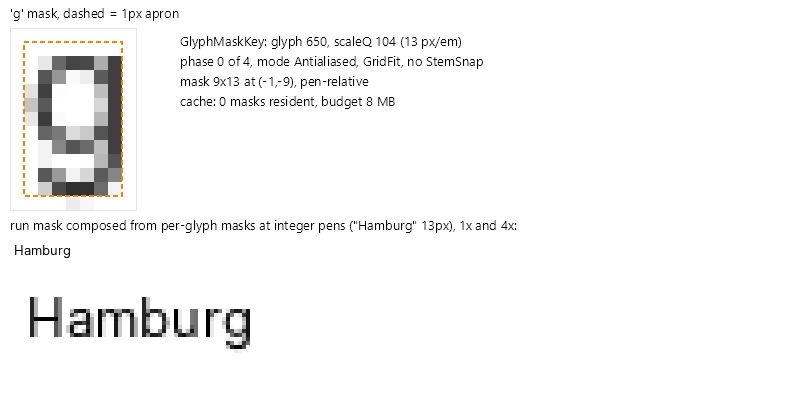

# The mask pipeline

The mask tier turns outlines into per-glyph 8-bit coverage masks, composes them into one immutable bitmap per run, and redraws that bitmap until the run or its transform changes. This document covers the pieces in build order.

## Contour capture: GlyphPathBuilder

[GlyphPathBuilder](../../src/Avalonia.Base/Media/Fonts/Rasterization/GlyphPathBuilder.cs) is an `IGeometryContext` that records verbs and points into reusable flat arrays. `GlyphTypeface.TryBuildGlyphContours(glyphIndex, transform, sink)` drives it through the shared glyf/CFF/CFF2 outline walkers with the caller's matrix, so capture happens directly in device space. The builder is reused via `Reset()`; a warm mask build allocates nothing for capture.

The builder also hosts the hinting warps: `ApplyVerticalWarp` and `ApplyHorizontalWarp` remap Y or X coordinates in place through a monotone piecewise-linear [AxisWarp](../../src/Avalonia.Base/Media/Fonts/Rasterization/VerticalGridFit.cs) before rasterization (see [hinting.md](hinting.md)).

## Rasterization: GlyphRasterizer

[GlyphRasterizer](../../src/Avalonia.Base/Media/Fonts/Rasterization/GlyphRasterizer.cs) is an analytic cell-coverage scanline rasterizer in the font-rs family: exact area coverage per pixel, no supersampling, nonzero and even-odd fill rules, an aliased threshold mode, pooled transient buffers and bit-deterministic output (the same contours produce the same bytes on every platform). Determinism is what makes cross-machine golden tests and the Slug quality oracle possible.

## The mask model

[GlyphMask](../../src/Avalonia.Base/Media/Fonts/Rasterization/GlyphMask.cs) is an immutable coverage bitmap plus placement (`Left`/`Top` relative to the glyph pen, `Width`, `Height`, `Channels`). [GlyphMaskKey](../../src/Avalonia.Base/Media/Fonts/Rasterization/GlyphMaskKey.cs) identifies a raster:

| Key part | Values | Meaning |
| --- | --- | --- |
| `Glyph` | glyph id | |
| `ScaleQ` | `Round(pixelsPerEm * ScaleQuantum)`, quantum 8 | zoom buckets of 1/8 px/em; animation snaps to the nearest bucket |
| `Phase` | 0..3 (`PhaseCount = 4`) | quarter-pixel horizontal subpixel position |
| `Mode` | `Antialiased`, `Aliased`, `Subpixel` | grayscale, thresholded, or 3-channel LCD |
| `GridFit` | bool, default true | vertical zone + stroke fitting applied (off for `TextHintingMode.None`) |
| `StemSnap` | bool, default false | horizontal stem snapping applied (`TextHintingMode.Strong`) |

Masks carry a transparent apron so filtering and warping never clip: `Apron = 1` pixel normally, `SubpixelApron = 2` for LCD masks and stem-snapped masks (snapping can move an edge outward by up to a pixel). Builds beyond `MaxMaskSize = 4096` in either dimension return the empty mask and the draw falls through to another tier.

[GlyphMasks.Build](../../src/Avalonia.Base/Media/Fonts/Rasterization/GlyphMasks.cs) executes a build: capture contours at the keyed scale and phase, apply the vertical warp (`GridFit`), apply the horizontal stem warp (`StemSnap`), then rasterize. Subpixel masks rasterize at 3x horizontal resolution and downfilter (see [subpixel.md](subpixel.md)).

*(Generated figure: run TextLab with `GLYPH_FIGURE_EXPORT_DIR=<dir>` to regenerate; the interactive version lives in TextLab's Glyphs view (click a glyph to open the pipeline inspector).)*

## Caches and budgets

Two cache levels exist, both allocation-free on hits:

- [GlyphMaskCache](../../src/Avalonia.Base/Media/Fonts/Rasterization/GlyphMaskCache.cs) hangs off each `GlyphTypeface` and holds per-glyph masks under a CLOCK (second chance) eviction ring with an 8 MB default budget (`DefaultBudgetBytes`). Population is demand-driven and exact-fit; nothing is allocated per font glyph count.
- [RunMaskCache](../../src/Avalonia.Base/Media/Fonts/Rasterization/RunMask.cs) lives on each managed glyph run and holds the composed run bitmaps: one primary slot plus 3 secondary slots (`SecondarySize`), keyed by [RunMaskKey](../../src/Avalonia.Base/Media/Fonts/Rasterization/RunMask.cs) (`ScaleQ`, origin phase, mode, tint when pre-tinted, `GridFit`, `PenSnap`). A run being scrolled or repainted hits the primary slot; a run animating between a few states cycles the secondaries.

Byte budgeting weighs LCD masks by their three channels, so subpixel text does not silently triple memory under the same numeric budget.

## Run composition: RunMaskComposer

[RunMaskComposer](../../src/Avalonia.Base/Media/Fonts/Rasterization/RunMaskComposer.cs) blits glyph masks into the run-level bitmap at integer pens:

- `ComposeAlpha` adds A8 coverage with saturation, the same clamp the rasterizer applies to accumulated winding, so composing non-overlapping glyphs is bit-identical to rasterizing all contours in one pass;
- `ComposeTinted` produces premultiplied BGRA from coverage and a tint, optionally through a gamma table (the portable path every backend can draw);
- `ComposeLcd` interleaves the three stripe channels into RGBA (alpha = channel max) with an optional BGR swap for panels with reversed stripe order;
- `ComposeBitmap` copies decoded strike pixels (nearest-neighbor scaled, clipped) for bitmap glyph runs.

Composition is chunked and exact: a composed run is byte-identical to composing each glyph alone and stitching.

## The backend fast path: IAlphaGlyphMaskContext

[IAlphaGlyphMaskContext](../../src/Avalonia.Base/Media/Fonts/Rasterization/IAlphaGlyphMaskContext.cs) is the optional capability a drawing context implements to accelerate mask drawing:

- `PrefersAlphaMasks` gates the untinted A8 flow: the mask is realized once (`CreateAlphaMask`) and tinted per draw (`DrawAlphaMask`), which removes color from the cache identity, so animating a foreground brush recomposes nothing. Skia reports true only for GPU-backed contexts; on the CPU raster pipeline color-modulated A8 draws measured about 6x slower than pre-tinted BGRA blits, so CPU targets use `ComposeTinted` instead.
- `CreateLcdMask`/`DrawLcdMask`/`TryGetLcdGeometry` are the subpixel equivalents (see [subpixel.md](subpixel.md)).

Backends without the interface still work: the renderer falls back to composing pre-tinted BGRA and drawing it through plain `DrawBitmap`, which is a mandatory backend capability.

## Gamma and contrast: MaskGamma

Linear alpha blending makes small dark-on-light text look thin and washed out; platform rasterizers apply a gamma/contrast transfer on coverage. [MaskGamma](../../src/Avalonia.Base/Media/Fonts/Rasterization/MaskGamma.cs) replicates the Skia mask-gamma model: 8 luminance-bucketed 256-entry tables (`Contrast = 0.5`, `Gamma = 2.2`, opposite-extreme destination assumption, endpoints pinned to 0 and 255). The correction applies at every monochrome blend site: tinted compose (table passed into `ComposeTinted`), the A8 fast path (per-bucket `SKColorFilter` tables in [MaskGammaFilters](../../src/Skia/Avalonia.Skia/MaskGammaFilters.cs)), the Slug tier's color filter, and analytically inside the LCD blender shader. The LCD channels take a second, deliberately weaker table family (`LcdGamma = 1.6`, `LcdContrast = 0.2`): subpixel coverage already triples effective edge resolution, and grayscale-strength boosting hardens stems past the platform look — the values are calibrated by the `LCD_GAMMA_CALIBRATION` probe, which scores candidates by RMSE against the DirectWrite-host LCD blob at identical glyphs, pens and hinting. COLR v0 layers are deliberately excluded from correction entirely: a nonlinear coverage transform would create visible seams where abutting layers meet.
