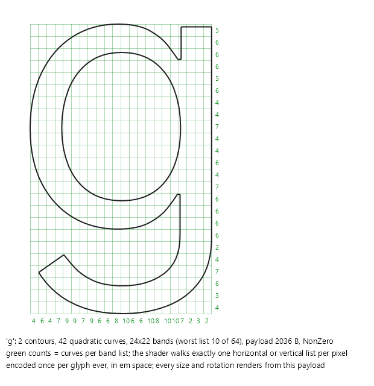

# The Slug vector tier

Masks are bitmaps: they decline rotated, skewed and very large text (past 160 px/em) because resampling a bitmap blurs it and giant masks waste memory. The vector tier renders those draws by evaluating the outline itself on the GPU, using the Slug algorithm by Eric Lengyel (the reference shaders are dual MIT/Apache-2.0 licensed, the patent is dedicated to the public domain, and attribution is carried in the shader source). A glyph is encoded once ever, in em space; after that any transform, any size and any rotation renders from the same payload.

The tier only runs on GPU-backed Skia contexts with the compiled runtime effect, and only while `FontManagerOptions.EnableSlugVectorTier` is true (checked per draw). Everything else falls to the native blob. CPU targets never use it: fragment evaluation measured around 580 ns per pixel, which is the quantified reason masks stay the CPU answer.

## Encoding (backend-neutral, in `Rasterization/Slug/`)

1. [SlugContourSink](../../src/Avalonia.Base/Media/Fonts/Rasterization/Slug/SlugContourSink.cs) captures the outline in em space and converts cubics to quadratics (flatten tolerance 1/1024 em, comfortably under the F16 payload quantization floor).
2. [SlugBandEncoder](../../src/Avalonia.Base/Media/Fonts/Rasterization/Slug/SlugBandEncoder.cs) partitions the em square into horizontal and vertical bands so the shader only tests curves that can affect its pixel's ray. The band count per axis (up to `MaxBandCount = 32`) is chosen by exhaustive sweep minimizing the largest curves-per-band, tie-broken toward fewer entries then fewer bands; curve order within a band sorts by control-point hull maximum (the value the shader's early-out compares) and band assignment uses exact quadratic extents.
3. [SlugTexelSerializer](../../src/Avalonia.Base/Media/Fonts/Rasterization/Slug/SlugTexelSerializer.cs) lays curves and band lists out in two RGBA F16 textures of width `TextureWidth = 2048`. The shader walks curve pairs, header blocks and band lists linearly without wrapping (only a list's start location wraps), so the serializer keeps each list within a row and duplicates the shared endpoint at row breaks. Hard caps guard the shader's static loop bounds: `MaxBandListLength = 64` entries per list, `MaxBandBlobSpan = 2047` texels, `MaxTextureRows = 2048`. A glyph exceeding any cap is declined atomically and the decline memoised.
4. [SlugReferenceEvaluator](../../src/Avalonia.Base/Media/Fonts/Rasterization/Slug/SlugReferenceEvaluator.cs) is a C# twin of the pixel shader (root classification via IEEE sign bits, imaginary-root collapse, two-ray weighted blend, even-odd fold). It exists so correctness is testable without a GPU: the shader must match the evaluator on identical texels, and the evaluator is validated against the analytic rasterizer as ground truth ([SlugTexelDecoder](../../src/Avalonia.Base/Media/Fonts/Rasterization/Slug/SlugTexelDecoder.cs) round-trips the serialization side).

*(Generated figure: run GlyphRasterDemo with `GLYPH_FIGURE_EXPORT_DIR=<dir>` to regenerate; the interactive version lives in the demo's Inspector page.)*

## Residency

[SlugTexelStore](../../src/Avalonia.Base/Media/Fonts/Rasterization/Slug/SlugTexelStore.cs) hangs off each `GlyphTypeface`: append-only texel arrays plus a `Version` counter that backend texture mirrors key off, with placements memoised permanently. Glyphs with no contours (spaces) realize as empty rather than declining, so whitespace never knocks a run off the tier. [SlugGlyphCache](../../src/Avalonia.Base/Media/Fonts/Rasterization/Slug/SlugGlyphCache.cs) bounds encoding memory at 2 MB per typeface with CLOCK eviction and memoised declines.

## Drawing (Skia side)

[ISlugGlyphRunContext](../../src/Avalonia.Base/Media/Fonts/Rasterization/Slug/ISlugGlyphRunContext.cs) is the capability seam: `SupportsSlugRendering` (GPU context and effect compiled) and `TryDrawSlugRun(run, store, tintArgb)`.

[SlugGlyphEffect](../../src/Skia/Avalonia.Skia/SlugGlyphEffect.cs) hosts the shader as a base-profile SkSL runtime effect: no `#version 300` requirement, loops statically bounded by the band-list cap, and the reference implementation's bit-level root-code table replaced by arithmetic (`mod(floor(n * exp2(-s)), 2)`), so the tier runs on every GPU backend including ES2-class GL. Runtime-effect adaptations: both textures sample as F16 nearest-neighbor shaders (no integer samplers in SkSL runtime effects, integers stay F16-exact up to 2048), the reference vertex-stage `fwidth` becomes per-draw uniforms (the L1 norms of the inverse transform rows, constant under affine transforms), and dilation becomes a device-rect inflation of about 1.5 px.

[SlugRunArtifact](../../src/Skia/Avalonia.Skia/SlugRunArtifact.cs) batches at run level: one `SKShader` for the whole run plus one local rect per inked glyph, cached on the managed run and disposed with it. The rebuild key is the per-axis scale bucket plus the store version, so translation, repeated draws under the same transform, tint changes and opacity changes reuse the artifact as-is; zooming (and continuous rotation, whose L1 footprint varies with angle) rebuilds through one shared `SKRuntimeShaderBuilder`. That builder is never disposed, because it owns the shared effect and disposing it would free the effect under later callers. Tint stays out of the bake: the shader emits premultiplied white coverage, color applies through a per-tint cached `Modulate` color filter and ambient opacity through the paint alpha, so foreground animation costs nothing.

## Quality and cost

The quality oracle compares two-ray shader coverage against 4x supersampled analytic rasterization over a text corpus at 0/15/30/45 degrees and 6-300 px, all rendered from single per-glyph payloads: zero interior/exterior misclassifications over roughly 2.2 million samples, with mean edge deltas from 1.2% at 6 px down to 0.12% at 300 px. Measured draw cost on the development machine: warm rotated frames 1.2-1.75 us per glyph at zero allocations; worst-case per-frame rebuild during a zoom gesture 2.2-4 us per glyph. The reference `SLUG_WEIGHT` stroke-boost is deliberately not ported (it over-inks by design and would fail the oracle).
