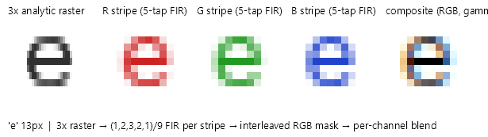

# Subpixel (LCD) rendering

The managed path renders ClearType-style subpixel-antialiased text on both GPU and CPU targets, following `TextOptions.TextRenderingMode`. `SubpixelAntialias` requests it, `Antialias` forces grayscale, `Alias` forces thresholded, and `Unspecified` resolves to subpixel whenever the surface is eligible, matching what backend text stacks do by default.

## Eligibility

Subpixel blending writes per-channel colors that only look right composited against known-opaque content in a known stripe orientation. `ResolveMaskMode` in [MaskGlyphRunRenderer](../../src/Avalonia.Base/Media/Fonts/Rasterization/MaskGlyphRunRenderer.cs) asks the drawing context via `IAlphaGlyphMaskContext.TryGetLcdGeometry`, which on Skia returns true only when all of the following hold:

- the target is a display-bound surface (window framebuffer or swapchain; `DrawingContextImpl.CreateInfo.SurfaceIsDisplay`). Offscreen targets - `RenderTargetBitmap`, `WriteableBitmap`, headless windows, capture harnesses - render grayscale even for an explicit `SubpixelAntialias` request: their output is composed, resampled or read back with alpha, where per-channel coverage has no valid interpretation (the DirectWrite rule);
- the surface declares horizontal RGB or BGR stripe geometry (`SKSurfaceProperties.PixelGeometry`, seeded from the render target; picture recording targets disable subpixel text explicitly);
- the draw is not inside any save layer (the context counts every `SaveLayer`/`Restore` pair) - layer content gets composited again, which would double-blend fringes;
- on GPU, the runtime blender compiled; on CPU, no tracked ambient opacity is active (the fixed two-pass payloads cannot fold opacity in; the GPU path folds it into the blender tint and stays eligible);
- the run has no color tables (color glyphs render grayscale, matching platform behavior).

Every failed condition degrades to grayscale antialiasing, never to wrong blending.

## Mask generation

`GlyphMaskMode.Subpixel` masks rasterize the outline at 3x horizontal resolution (the analytic rasterizer takes the anisotropic transform as-is), then each stripe channel is downfiltered with the standard 5-tap FIR `(1,2,3,2,1)/9` used by ClearType and FreeType. The result is an interleaved 3-channel `GlyphMask` (`Channels = 3`) in fixed RGB stripe order with a 2-pixel apron (`SubpixelApron`) for filter support. BGR panels are handled at composition time by swapping channels, so one mask serves both geometries.



*(Generated figure: run TextTestApp with `GLYPH_FIGURE_EXPORT_DIR=<dir>` to regenerate; the interactive version lives in TextTestApp's Rasterization tab.)*

## GPU path: runtime blender

The composed run mask is RGBA: the three coverage channels plus alpha = channel max. [LcdTextBlender](../../src/Skia/Avalonia.Skia/LcdTextBlender.cs) is an `SKRuntimeEffect` blender that computes, per channel, `dst + (tint - dst) * g(coverage)` where `g` is the analytic LCD-strength MaskGamma transfer (gamma 1.6, contrast 0.2 — calibrated against the DirectWrite-host blob, weaker than the grayscale correction by design) evaluated in-shader from `GammaShaderParameters`, exponent included as a uniform, so GPU output matches the CPU tables. The destination alpha uses the max coverage channel. Tint and ambient opacity are uniforms, so foreground animation never recomposes the mask. Compiled blenders are cached per tint with a small cap (`CacheCap = 64`); the shared effect is created once and never disposed. Measured cost is on par with the grayscale A8 path on native GL and about 2x on ANGLE's dst-read lowering, at zero steady-state allocations.

## CPU path: two passes

CPU raster targets have no blender API, so the same per-channel lerp is decomposed algebraically into two portable bitmap draws using only core blend modes:

```
pass 1: DrawBitmap(Multiply)  with per-channel 255 - g(coverage)     multiplies dst by (1 - g)
pass 2: DrawBitmap(Plus)      with per-channel premul tint * g(cov)  adds tint * g
```

`RunMaskComposer.ComposeLcd` bakes the gamma tables into both payloads at compose time, keyed by tint; the pair is cached as one run-mask entry (`LcdRunBitmaps`). The result is exact to rounding: a formula-equivalence test pins the composed output against a direct software per-channel blend within one level on white, black, gray and saturated backgrounds.

## Interaction with hinting

Subpixel rendering and hinting compose: LCD masks go through the same vertical grid fit and, under `Strong`, stem snapping (in 3x device space, converted through the subpixel factor) and integer pen snapping. Vertical zone snapping matters more for LCD than for grayscale, because the eye reads horizontal feature smear as color fringing on top of blur.
